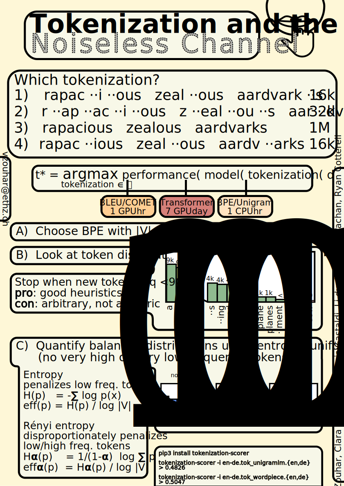

# Tokenization Principle

[](https://aclanthology.org/2023.acl-long.284/)
&nbsp;
[](https://www.youtube.com/watch?v=yeEZpf4BlDA)

Why are some tokenizations better than others? 

> **Abstract**: Subword tokenization is a key part of most NLP pipelines. However, little is known about why some tokenizer and hyperparameter combinations lead to improved downstream model performance over others. We propose that good tokenizers lead to efficient channel usage, where the channel is the means by which some input is conveyed to the model and efficiency can be quantified in information-theoretic terms as the ratio of the Shannon entropy to the maximum entropy of the subword distribution. Nevertheless, an optimal encoding according to Shannon entropy assigns extremely long codes to low-frequency subwords and very short codes to high-frequency subwords.Defining efficiency in terms of Rényi entropy, on the other hand, penalizes distributions with either very high or very low-frequency subwords.We posit that (1) extremely high-frequency subwords are problematic because their meaning is not distinct and (2) that low-frequency subwords may not appear frequently enough for their meaning to be learned properly; encodings that induce unigram distributions with either can harm model performance. In machine translation, we find that across multiple tokenizers, the Rényi entropy has a very strong correlation with BLEU: 0.82 in comparison to just -0.30 for compressed length.

- read the [paper here](https://aclanthology.org/2023.acl-long.284/),
- use the [tokenization-scorer](https://github.com/zouharvi/tokenization-scorer),
- watch a quick [3-minute video](https://www.youtube.com/watch?v=rCBDcKD8UEg) of the paper,
- watch a [13-minute video](https://www.youtube.com/watch?v=yeEZpf4BlDA) of the paper and two others,

Cite as:
```
@inproceedings{tokenization_noiseless, 
    title={Tokenization and the Noiseless Channel},
    author={Zouhar, Vilém and Meister, Clara and Gastaldi, Juan Luis and Sachan, Mrinmaya and Cotterell, Ryan},
    booktitle={Proceedings of the 61st Annual Meeting of the Association for Computational Linguistics},
    year={2023},
    url={https://aclanthology.org/2023.acl-long.284/},
}
```


